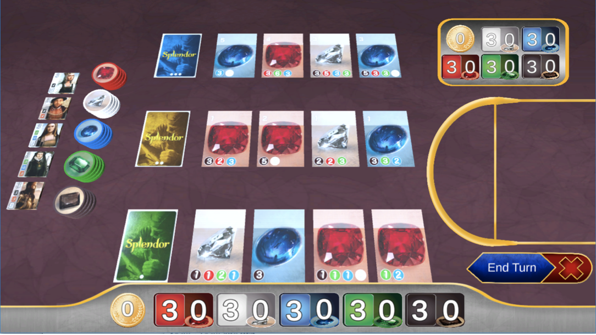

## Splendor Game (스플렌더 게임)

&nbsp;&nbsp;&nbsp;&nbsp;&nbsp;&nbsp;&nbsp;&nbsp;&nbsp;&nbsp;&nbsp;&nbsp;&nbsp;&nbsp;&nbsp;&nbsp;&nbsp;&nbsp;&nbsp;&nbsp;&nbsp;&nbsp;&nbsp;&nbsp;&nbsp;&nbsp;&nbsp;&nbsp;&nbsp;&nbsp;&nbsp;&nbsp;&nbsp;&nbsp;&nbsp;&nbsp;&nbsp;&nbsp;&nbsp;&nbsp;&nbsp;&nbsp;&nbsp;&nbsp;&nbsp;&nbsp;&nbsp;&nbsp;&nbsp;&nbsp;&nbsp;&nbsp;&nbsp;&nbsp;&nbsp;&nbsp;&nbsp;&nbsp;&nbsp;&nbsp;*2019-1 응용소프트웨어실습 팀 프로젝트*

**프로세스간 소켓 통신을 사용해 스플렌더 게임 구현**

**C#을 사용하여 서버는 Winform으로, 클라이언트는 Unity를 사용해 구현**

 

- **구현한 기능 소개**
  - 소켓을 사용한 서버 - 클라이언트 모델
  - 메인 화면 - Unity
  - 게임 - 서버,클라이언트 통신 및 게임 규칙 구현

 

- **사용한 언어 및 도구, 라이브러리**
  + C
  + Winform
  + Unity

 

+ **개발 환경**
  + Windows 10
  + Visual Studio

 

- **프로젝트 구성원 및 개발 기간**
  + 광운대학교 소프트웨어학부 윤홍찬, 김민욱, 박지호, 양재영
  + 2019.4.10 ~ 6.17

 

- **스크린샷**

  </img>
  
   
  
  </img>

---

> 2019.7.13 최종 업데이트
>
> 광운대학교 소프트웨어학부 윤홍찬

